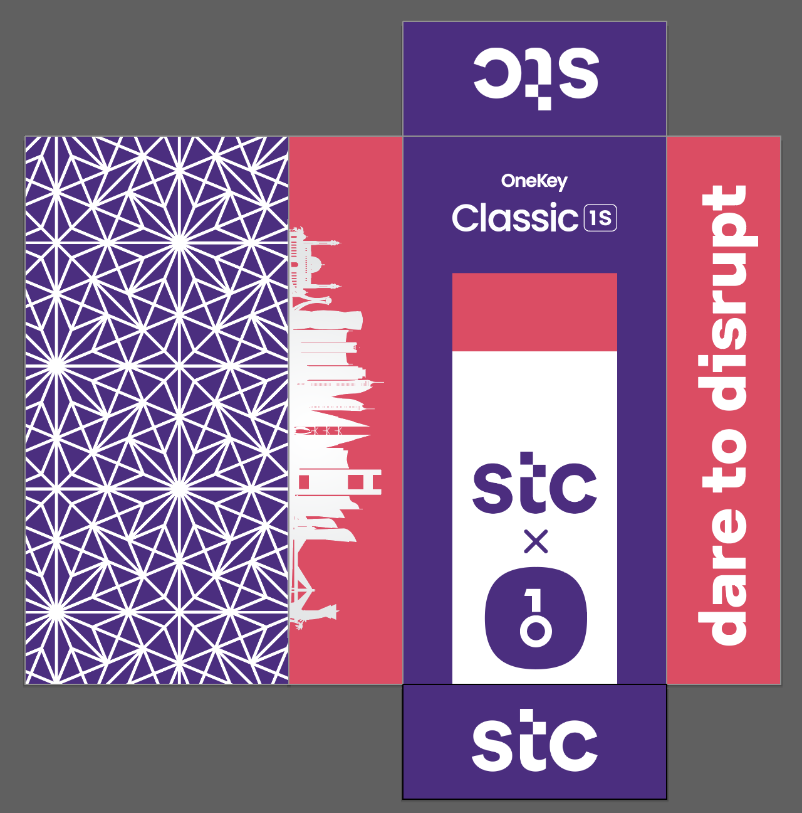
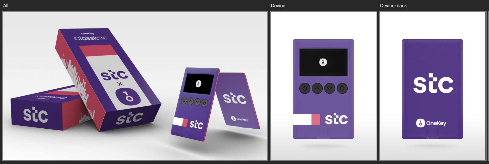

# stc Bahrain Branded OneKey Wallet

This repository contains the design files for the stc Bahrain branded OneKey wallet. 

The OneKey wallet is customized with stc Bahrain's visual identity to align with its brand presence in the region. The box showcases elements of Bahrain's cultural and architectural landmarks, most notably the Manama skyline, blending modern aesthetics with regional pride. The back of the box showcases Middle Eastern motifs. The rest of the box and the device uses stc colours and style.

## Box Layout

The following image displays the layout of the box, incorporating stc Bahrain branding and the Manama skyline:

## Mockup

Below is a mockup of the OneKey wallet, featuring the stc Bahrain branding:

### Files Included

- **box_layout.png**: The box layout with stc Bahrain branding and the Manama skyline.
- **mockup.png**: A visual mockup of the OneKey wallet with stc Bahrain's identity.
- **stcOneKey_BOX.ai and stcOneKey_DEVICE.ai**: The illustration files for the box and device.
